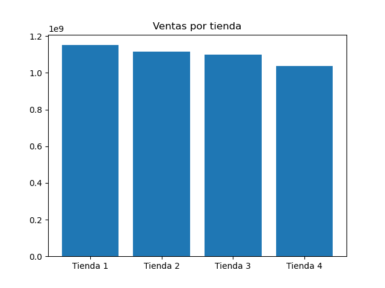
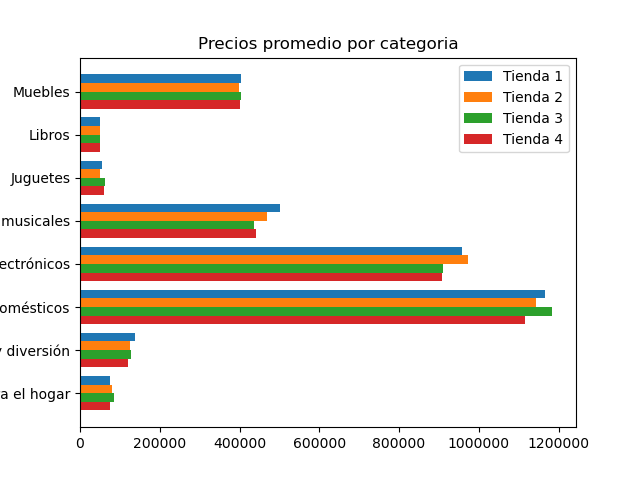

# 🛍️ Alura Store - Análisis de Datos

Este proyecto fue desarrollado como parte del curso de Análisis de Datos de **Alura**. El objetivo es aplicar herramientas de análisis exploratorio para evaluar el desempeño de diferentes tiendas en la plataforma Alura Store, con el fin de identificar cuál de ellas presenta el peor rendimiento general.

---

## 📌 Propósito del Análisis

El análisis se centra en:

- Evaluar ingresos totales, calificaciones promedio de los clientes y costos logísticos por tienda.
- Analizar los precios promedio por categoría de productos.
- Identificar patrones de venta y diferencias de rendimiento entre las tiendas.
- Determinar cuál tienda es menos eficiente y justificar esa elección con base en los datos.

---

## 📁 Estructura del Proyecto

El proyecto está organizado de la siguiente manera:

    ├── notebooks/  
    │ └── AluraStoreLatam.ipynb  
    ├── base-de-datos-challenge1-latam/
    │ └── tienda1.csv  
    │ └── tienda2.csv  
    │ └── tienda3.csv  
    │ └── tienda4.csv  
    ├── img/  
    │ └── graficos_comparativos.png  
    ├── README.md

---

## 📊 Ejemplos de Gráficos e Insights

Algunos de los gráficos generados en el análisis incluyen:

<ul>
  <li>
    Barras verticales comparando ingresos por tienda.
     
    

      
    

  </li>

  <li>
    Barras agrupadas que comparan precios promedio por categoría y tienda.
     
    

      
    

  </li>

  <li>
    Gráficos circulares para mostrar distribución de productos por categoría.
     
    

      
    

  </li>
</ul>

### 📌 Principales Insights

- La **Tienda 4** fue identificada como la **menos eficiente**, ya que presenta:
  - El ingreso total más bajo.
  - Una calificación promedio que no destaca.
  - Precios menores en categorías clave.
- La **Tienda 3**, por otro lado, presenta la mejor valoración por parte de los clientes.
- El costo de envío promedio más bajo lo tiene la **Tienda 4**, pero eso no se traduce en mejor desempeño.

---

## ▶️ Instrucciones para Ejecutar el Notebook

1. Cloná este repositorio o descargalo como archivo `.zip`.
2. Asegurate de tener instalado Python 3 con las siguientes librerías:
   - `pandas`
   - `matplotlib`
   - `numpy`
3. Abrí el archivo `AluraStoreLatam.ipynb` en Jupyter Notebook o Google Colab.
4. Ejecutá todas las celdas en orden para reproducir el análisis y visualizar los gráficos.

> También podés ejecutar el notebook directamente en [Google Colab](https://colab.research.google.com/) subiendo los archivos del proyecto.

---

## ✍️ Autor

Proyecto desarrollado como parte de la formación en análisis de datos con Python en Alura.  
¡Aportes y mejoras son bienvenidos!